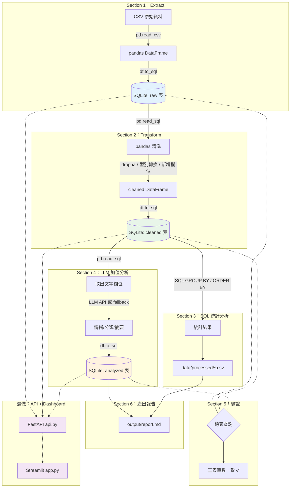

# LLM × DE MVP Builder 實戰營

> TibaMe 雲端資料工程師養成班 — 期中實戰營 Starter Repo
>
> 📋 學員手冊：[_instructor/student_handbook.md](_instructor/student_handbook.md)

每位學員選一個題目，完成 **Mini Data Pipeline**：

```
CSV → pandas 清洗 → SQLite (raw/cleaned/analyzed) → SQL Query → (LLM 分析) → FastAPI → Streamlit
```

## 快速開始

```bash
# 1. Clone（或下載 ZIP 解壓縮）
git clone https://github.com/lu791019/midterm-mvp-template.git
cd midterm-mvp-template

# 2. 選你的題目（1-6），打開對應的 Notebook
#    例如選題目 1：
#    → 用 Colab：上傳 data/raw/topic_1/pipeline_starter.ipynb
#    → 用本地：jupyter notebook data/raw/topic_1/pipeline_starter.ipynb

# 3. 照著 Notebook 一格一格跑
```

## 詳細步驟導覽

> 第一次用不知道去哪找東西？照下面走一遍。

### Step 1：選題

到下方「[你的題目](#你的題目)」表格，選一個你有興趣的題目（1-8）。
假設你選了 **題目 1（零售 POS 銷售分析）**。

### Step 2：看需求

打開你的題目資料夾，先讀需求規格書：

```
📂 data/raw/topic_1/
└── 📄 requirements_spec.md    ← 先讀這個！裡面有：
                                  - 你要扮演什麼角色
                                  - 客戶的問題是什麼
                                  - 資料有哪些欄位
                                  - 今天的 MVP 要做到什麼
```

### Step 3：開 Notebook 開始做

同一個資料夾裡有你的 Notebook：

```
📂 data/raw/topic_1/
├── 📄 requirements_spec.md    ← Step 2 讀過了
├── 📊 orders.csv              ← 你的原始資料（2,000 筆交易紀錄）
└── 📓 pipeline_starter.ipynb  ← 打開這個！照著一格一格跑
```

**用 Google Colab 開**：到 [colab.google](https://colab.research.google.com/) → 上傳 → 選 `pipeline_starter.ipynb`
**用本地開**：`jupyter notebook data/raw/topic_1/pipeline_starter.ipynb`

### Step 4：跑完後，產出在哪裡

Notebook 跑完後，你的成果會出現在：

```
📂 data/raw/topic_1/              ← 你的題目資料夾
├── 🗄️ pipeline.db               ← SQLite 資料庫（自動產生）
│   ├── raw_orders 表                原始資料
│   ├── cleaned_orders 表            清洗後資料
│   └── analyzed_orders 表           LLM 分析結果
│
├── 📂 processed/                 ← 統計結果 CSV（自動產生）
│   └── product_stats.csv 等
│
└── 📂 output/                    ← 顧問報告（自動產生）
    └── report.md
```

> 💡 所有產出都在**你自己的題目資料夾**裡，不會跟別人的混在一起。

### Step 5：選做 — FastAPI + Streamlit

如果你還有時間，同一個資料夾裡有 API 和 Dashboard：

```
📂 data/raw/topic_1/
├── api.py     ← FastAPI API
└── app.py     ← Streamlit Dashboard
```

**`api.py` 是什麼？為什麼需要它？**

你在 Step 3 跑完 Notebook 後，分析結果都存在 `pipeline.db`（SQLite 資料庫）裡。
`api.py` 用 FastAPI 把資料庫裡的結果**包裝成 API endpoint**，讓別人（或前端）可以透過網址取得你的分析：

```
GET /health     → 確認 API 和資料庫正常運作
GET /stats/...  → 回傳統計結果（從 cleaned 表查詢）
GET /analyzed   → 回傳 LLM 分析結果（從 analyzed 表查詢）
GET /summary    → 回傳 pipeline 三表的摘要統計
GET /report     → 回傳 output/report.md 的報告內容
```

這就是真實資料工程的做法：**資料存在資料庫 → API 提供存取 → 前端呈現**，而不是直接傳 CSV 給別人。

**`app.py` 是什麼？為什麼需要它？**

`app.py` 用 Streamlit 把你的分析結果**變成互動式 Dashboard**。
它可以直接讀 SQLite，也可以透過 `api.py` 的 API 拿資料（體驗「前後端分離」的架構）。
打開後你會看到：圖表、統計數字、LLM 分析明細、顧問報告——這就是你交給客戶看的東西。

**怎麼跑？**

```bash
# 啟動 API（先裝 uvicorn）
pip install fastapi uvicorn
uvicorn data.raw.topic_1.api:app --reload --port 8000

# 另開 terminal，啟動 Dashboard
pip install streamlit
streamlit run data/raw/topic_1/app.py
```

### Step 6：打包

跑完後，填寫以下兩份文件完成打包：

| 要填什麼 | 在哪裡 | 說明 |
|---------|--------|------|
| 後續升級計畫 | [docs/upgrade_plan.md](docs/upgrade_plan.md) | 寫下你打算怎麼用 Docker/Airflow/GCP 升級這個專案 |
| README | 用講師提供的模板 | 填完就是你的作品集說明文件 |

### 遇到問題？

| 狀況 | 去哪找幫助 |
|------|-----------|
| 不知道 pandas 語法怎麼寫 | [docs/ai_prompts.md](docs/ai_prompts.md) 有 prompt 模板，貼給 ChatGPT |
| 不知道 LLM prompt 怎麼設計 | [docs/ai_prompts.md](docs/ai_prompts.md) 的第 5、6 節 |
| 想知道資料從哪來的 | [docs/data_sources.md](docs/data_sources.md) |
| 想看其他題目的規格 | [docs/topic_catalog.md](docs/topic_catalog.md) |
| 想了解為什麼用 SQLite 不用 MySQL | [docs/tech_decision.md](docs/tech_decision.md) |

---

## Pipeline 流程

Notebook 會帶你走完以下 6 個 Section，每個 Section 對應 pipeline 的一個階段：



| Section | 做什麼 | 產出 |
|---------|--------|------|
| 1. Extract | 讀 CSV → 寫入 SQLite `raw` 表 | `pipeline.db` 的 raw 表 |
| 2. Transform | 從 raw 表讀出 → pandas 清洗 → 寫入 `cleaned` 表 | cleaned 表 |
| 3. SQL 統計 | 從 cleaned 表用 SQL 查詢統計 | `data/processed/*.csv` |
| 4. LLM 分析 | 從 cleaned 表讀文字 → LLM 分析 → 寫入 `analyzed` 表 | analyzed 表 |
| 5. 驗證 | 跨表查詢確認三表一致（data lineage） | 驗證通過 ✓ |
| 6. 報告 | 整合統計 + LLM 結果 → 生成顧問報告 | `output/report.md` |
| 選做 | FastAPI 提供 API → Streamlit 顯示 Dashboard | API + Dashboard |

> 完整流程圖 Mermaid 原始檔：[docs/pipeline.mmd](docs/pipeline.mmd)

## Repo 結構

```
midterm-mvp-template/
│
├── README.md                    ← 📍 你在這裡
├── requirements.txt             ← Python 套件（pip install -r requirements.txt）
├── .env.example                 ← API Key 設定範例（複製成 .env 填入）
│
├── data/raw/                    ← 📂 6 個題目的資料與工具
│   ├── topic_1/                 ← 題目 1：零售 POS 銷售分析
│   │   ├── requirements_spec.md     需求規格書（情境/角色/資料/MVP scope）
│   │   ├── orders.csv               2,000 筆零售交易紀錄（品項/數量/金額/客戶/國家）
│   │   ├── pipeline_starter.ipynb           📓 Notebook（從這裡開始做！）
│   │   ├── api.py                   ⭐ 選做：FastAPI API
│   │   ├── app.py                   ⭐ 選做：Streamlit Dashboard
│   │   ├── processed/               📂 你的統計結果（跑完自動產生）
│   │   └── output/                  📂 你的報告（跑完自動產生）
│   ├── topic_2/                 ← 題目 2：B2C 電商競品比價
│   │   ├── requirements_spec.md / pipeline_starter.ipynb / api.py / app.py
│   │   └── products.csv             2,000 筆跨平台商品價格
│   ├── topic_3/                 ← 題目 3：音樂串流趨勢分析
│   │   ├── requirements_spec.md / pipeline_starter.ipynb / api.py / app.py
│   │   └── tracks.csv               2,000 筆 Spotify 歌曲（29 欄）
│   ├── topic_4/                 ← 題目 4：叫車服務交通熱點
│   │   ├── requirements_spec.md / pipeline_starter.ipynb / api.py / app.py
│   │   ├── trips.csv                2,000 筆 NYC 計程車行程（19 欄）
│   │   └── taxi_zone_lookup.csv     區域碼 → 地名對照表
│   ├── topic_5/                 ← 題目 5：求職媒合薪資洞察
│   │   ├── requirements_spec.md / pipeline_starter.ipynb / api.py / app.py
│   │   └── jobs.csv                 2,000 筆資料領域職缺與薪資（12 欄）
│   └── topic_6/                 ← 題目 6：不動產房價趨勢分析
│       ├── requirements_spec.md / pipeline_starter.ipynb / api.py / app.py
│       └── real_estate.csv          2,000 筆台灣實價登錄（34 欄）
│
│
├── docs/                        ← 📂 參考文件（不需要改，需要時查閱）
│   ├── topic_catalog.md             6 題總覽：每題的 MVP 問題/資料/ETL/LLM 規格
│   ├── data_sources.md              資料來源說明：每題的 Kaggle/政府 URL + 欄位
│   ├── ai_prompts.md                AI prompt 模板：7 個可直接用的 prompt
│   ├── repo_format.md               Repo 格式說明：資料夾結構 + 最小交付標準
│   ├── tech_decision.md             工具選型紀錄（為什麼選 SQLite/pandas/etc.）
│   ├── pipeline.mmd                 Pipeline 流程圖（Mermaid 格式）
│   └── upgrade_plan.md              📝 後續升級計畫模板（你要填的！）
│
├── _advanced/                   ← 📂 進階升級用（期中不需要看，後續課程會用到）
│   ├── Dockerfile                   Docker 容器化模板
│   └── docker-compose.yml           Docker Compose 設定
│
└── _instructor/                 ← 📂 講師用（學員不需要看）
    ├── mvp_builder_slides.html        投影簡報（26 張 HTML）
    ├── speaker_notes.md              講稿（逐字稿）
    ├── facilitator_guide.md          講師引導手冊
    ├── student_handbook.md           學員手冊
    ├── midterm_workshop_proposal.md  工作坊企劃書
    └── solutions/                    每題 pipeline 完整答案
        ├── topic_1_solution.ipynb
        ├── topic_2_solution.ipynb
        ├── topic_3_solution.ipynb
        ├── topic_4_solution.ipynb
        ├── topic_5_solution.ipynb
        └── topic_6_solution.ipynb
```

## 你的題目

選一個，打開該資料夾的 `requirements_spec.md` 看需求，然後跑 `pipeline_starter.ipynb`：

| # | 題目 | 資料 | 數值欄 | LLM 做什麼 | 詳細需求 |
|---|------|------|--------|-----------|---------|
| 1 | 零售 POS 銷售分析 | 2,000 筆交易（品項/數量/金額/客戶/國家） | 6 | 品類分類 + 客戶洞察 | [requirements_spec.md](data/raw/topic_1/requirements_spec.md) |
| 2 | B2C 電商競品比價 | 2,000 筆跨平台商品價格 | 5 | 書籍分類 + 定價建議 | [requirements_spec.md](data/raw/topic_2/requirements_spec.md) |
| 3 | 音樂串流趨勢分析 | 2,000 筆 Spotify 歌曲（29 欄） | 12 | 曲風分類 + 推薦文案 | [requirements_spec.md](data/raw/topic_3/requirements_spec.md) |
| 4 | 叫車服務交通熱點 | 2,000 筆 NYC 計程車行程 | 16 | 區域分類 + 調度建議 | [requirements_spec.md](data/raw/topic_4/requirements_spec.md) |
| 5 | 求職媒合薪資洞察 | 2,000 筆資料領域職缺與薪資 | 3 | 職位分類 + 職涯建議 | [requirements_spec.md](data/raw/topic_5/requirements_spec.md) |
| 6 | 不動產房價趨勢 | 2,000 筆台灣實價登錄（34 欄） | 17 | 區域分析建議書 | [requirements_spec.md](data/raw/topic_6/requirements_spec.md) |

> 資料來源詳情見 [docs/data_sources.md](docs/data_sources.md)

## 每人最低完成標準

- [ ] 跑完 `pipeline_starter.ipynb` 的 Section 1-6
- [ ] 題目資料夾裡的 `pipeline.db` 有 raw / cleaned / analyzed 三張表
- [ ] `processed/` 有統計結果 CSV
- [ ] `output/report.md` 有 LLM 分析報告
- [ ] 能用 3 分鐘說明：題目、資料、pipeline、output
- [ ] 填完 [docs/upgrade_plan.md](docs/upgrade_plan.md)

## AI 使用規範

本活動**允許並鼓勵**使用 AI，但要能說明你的 pipeline：

| 用法 | 是否允許 |
|------|---------|
| 用 ChatGPT/Claude 生成 pandas/SQL 草稿 | ✅ 允許 |
| 用 AI debug 錯誤訊息 | ✅ 允許 |
| 用 LLM API 做分類/摘要 | ✅ 允許 |
| 完全貼上不了解的程式碼 | ⚠️ 不建議（Demo 時要能說明） |

> 可直接用的 prompt 模板見 [docs/ai_prompts.md](docs/ai_prompts.md)

## 後續升級

這個 MVP 不是一次性練習。後續課程會持續升級這個專案：

| 階段 | 升級內容 |
|------|---------|
| 後續課程 | 回顧你的 MVP → 拆成正式 ETL 架構 |
| Docker | 容器化 pipeline（模板在 [_advanced/](\_advanced/)） |
| Airflow | run_pipeline 改成 Airflow 的程式碼流程(DAG) |
| MySQL / BigQuery | CSV 換成資料庫 |
| GCP | 部署到雲端 |

> 升級計畫模板：[docs/upgrade_plan.md](docs/upgrade_plan.md)
> Docker 模板參考：[_advanced/Dockerfile](_advanced/Dockerfile)

## 文件索引

| 文件 | 用途 | 什麼時候看 |
|------|------|-----------|
| [docs/README_TEMPLATE.md](docs/README_TEMPLATE.md) | 個人 README 填空模板 | **打包時填寫！** |
| [docs/topic_catalog.md](docs/topic_catalog.md) | 6 題的 MVP 問題、資料、ETL、LLM 規格 | 選題時 |
| [docs/data_sources.md](docs/data_sources.md) | 每題資料的 Kaggle/政府 URL、欄位、授權 | 想了解資料從哪來時 |
| [docs/ai_prompts.md](docs/ai_prompts.md) | 7 個 AI prompt 模板（需求釐清/pandas/debug/LLM/README） | 實作中需要 AI 幫忙時 |
| [docs/repo_format.md](docs/repo_format.md) | Repo 資料夾結構、最小交付標準、題目切換方式 | 想了解 repo 設計時 |
| [docs/tech_decision.md](docs/tech_decision.md) | 工具選型理由（為什麼 SQLite/pandas/Colab） | 想知道為什麼這樣選時 |
| [docs/pipeline.mmd](docs/pipeline.mmd) | Pipeline 流程圖（Mermaid） | 想看整體架構時 |
| [docs/upgrade_plan.md](docs/upgrade_plan.md) | 後續升級計畫模板 | **學員需要填的！**  |
