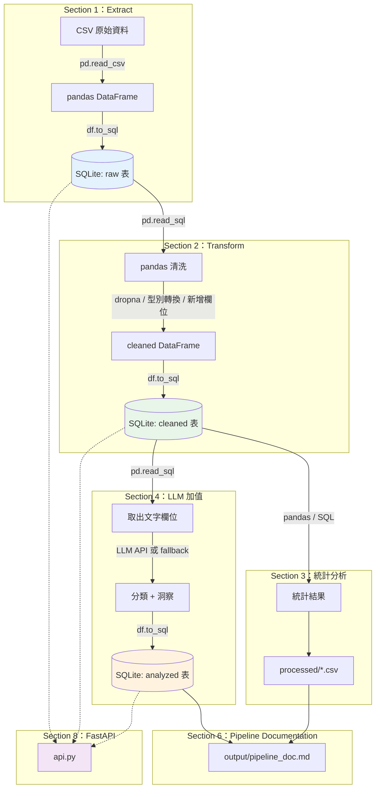

# LLM × DE MVP Builder 實戰工作坊

> TibaMe 雲端資料工程師在職遠距班 — 期中實戰工作坊 Starter Repo
>
> 🚀 **現場速查卡**：[START_HERE.md](START_HERE.md)
> 📋 **學員手冊**：[_instructor/student_handbook.md](_instructor/student_handbook.md)

每位學員選一個題目，完成一條 **Mini Data Pipeline**：

```
CSV → pandas → SQLite (raw/cleaned/analyzed) → 統計分析 → LLM → Pipeline Documentation → FastAPI
```

---

## 快速開始

```bash
git clone https://github.com/lu791019/midterm-mvp-template.git
cd midterm-mvp-template
# 選題 → 開 Notebook → 照 Section 跑
```

---

## Step 1：環境 + 選題（25 min）

> 對應簡報 Slide 13 ｜ Notebook Section 0

### 1-1 選題

| # | 題目 | 資料 | 一句話 | 需求 |
|---|------|------|--------|------|
| 1 | 零售 POS 銷售分析 | 2,000 筆交易 | 找暢銷商品和高價值客戶 | [spec](data/raw/topic_1/requirements_spec.md) |
| 2 | B2C 電商競品比價 | 2,000 筆商品 | 跨平台價差分析 | [spec](data/raw/topic_2/requirements_spec.md) |
| 3 | 音樂串流趨勢分析 | 2,000 筆歌曲 | Spotify / YouTube / TikTok | [spec](data/raw/topic_3/requirements_spec.md) |
| 4 | 叫車服務交通熱點 | 2,000 筆行程 | 時段 × 地區（最複雜）| [spec](data/raw/topic_4/requirements_spec.md) |
| 5 | 求職媒合薪資洞察 | 2,000 筆職缺 | 資料領域薪資行情 | [spec](data/raw/topic_5/requirements_spec.md) |
| 6 | 不動產房價趨勢 | 2,000 筆登錄 | 台灣實價登錄（中文）| [spec](data/raw/topic_6/requirements_spec.md) |

> 資料來源詳情見 [docs/data_sources.md](docs/data_sources.md)

### 1-2 讀需求 → 開 Notebook

```
📂 data/raw/topic_N/
├── 📄 requirements_spec.md    ← 先讀：情境/角色/資料/MVP scope
├── 📊 xxx.csv                 ← 原始資料（2,000 筆）
└── 📓 pipeline_starter.ipynb  ← 從這裡開始做
```

- **Colab**：上傳 `pipeline_starter.ipynb`，Section 0 自動 clone repo + 設定環境
- **本地**：`jupyter notebook data/raw/topic_N/pipeline_starter.ipynb`

### 1-3 跑 Section 0（環境設定）

> ✅ 基礎完成：Notebook 跑通、已選題、已讀需求

---

## Step 2：ETL Pipeline（45 min）

> 對應簡報 Slide 15 ｜ Notebook Section 1-3

| Section | 做什麼 | 交付物 |
|---------|--------|--------|
| 1 | Extract — 讀 CSV → 寫入 **raw 表** | `pipeline.db` 的 raw 表 |
| 2 | Transform — 清洗 → 寫入 **cleaned 表** | cleaned 表 |
| 3 | 統計分析（pandas / SQL）| `processed/*.csv` |

每個 Section 開頭有 🎯 完成標準。Section 3 之後有「💡 你還可以分析什麼」進階探索提示。

> ✅ 基礎完成：pipeline.db 有 raw + cleaned 表、processed/ 有統計 CSV、有一個能 Demo 講的數字

---

## Step 3：LLM + Doc + API（30 min）

> 對應簡報 Slide 20 ｜ Notebook Section 4-8

| Section | 做什麼 | 交付物 |
|---------|--------|--------|
| 4 | LLM / fallback → 寫入 **analyzed 表** + 三表驗證 | analyzed 表 |
| 6 | Pipeline Documentation | `output/pipeline_doc.md` |
| 7 | Next Step 規劃 | 填 `pipeline_doc.md` Section 10 |
| 8 | FastAPI | API `/health` 回 200 |

> ✅ 基礎完成：三表齊全、pipeline_doc.md 存在、FastAPI 跑得起來

### FastAPI 怎麼跑

```bash
cd data/raw/topic_N
pip install fastapi uvicorn
uvicorn api:app --reload --port 8000
# 開瀏覽器 http://localhost:8000/health
```

| Endpoint | 說明 |
|----------|------|
| `GET /health` | 確認 API + DB 狀態 |
| `GET /stats/...` | 統計結果 |
| `GET /analyzed` | LLM 分析結果 |
| `GET /summary` | 三表摘要 |

---

## Demo

每組推派 1 人 × 3 分鐘：問題 → 清洗 → LLM → output → 升級方向

---

## Step 4：課後

1. **Dashboard**（Section 9-10）：ipywidgets 或 Streamlit，`app.py` 已有 solution
2. **Push 到你的 GitHub**：把整個 topic 資料夾推到你自己的 repo
3. **pipeline_doc.md → README.md**：用 `output/pipeline_doc.md` 整理成 repo 的 README

> 💡 用 [docs/ai_prompts.md](docs/ai_prompts.md) 的 **Prompt #7**，貼 notebook 資訊給 AI，自動產出 Pipeline Documentation 草稿。

**目的**：你的 GitHub repo 就是作品集。Pipeline Documentation 當 README，面試官打開就看得懂你做了什麼。

---

## Pipeline 架構



---

## Repo 結構

```
midterm-mvp-template/
├── README.md                          ← 📍 你在這裡
├── START_HERE.md                      ← 🚀 現場速查卡
├── requirements.txt
├── .env.example
│
├── data/raw/topic_N/                  ← 📂 6 個題目
│   ├── requirements_spec.md               需求規格書
│   ├── xxx.csv                            原始資料（2,000 筆）
│   ├── pipeline_starter.ipynb             📓 Notebook
│   ├── api.py                             FastAPI（活動內容）
│   ├── app.py                             Dashboard（回家作業）
│   ├── processed/                         統計產出
│   └── output/                            pipeline_doc.md
│
├── docs/                              ← 📂 參考文件
│   ├── README_TEMPLATE.md                 Pipeline Documentation 模板
│   ├── ai_prompts.md                      AI prompt（含 Prompt #7 自動填文件）
│   ├── upgrade_plan.md                    後續升級計畫（已併入 pipeline_doc Section 10）
│   ├── topic_catalog.md                   6 題總覽
│   ├── data_sources.md                    資料來源
│   ├── pipeline.mmd                       Pipeline 流程圖
│   ├── repo_format.md                     Repo 格式說明
│   └── tech_decision.md                   工具選型紀錄
│
├── _advanced/                         ← Docker 模板（後續課程用）
└── _instructor/                       ← 講師用（學員不需看）
```

---

## 完成標準

### 現場必做

- [ ] Section 1-8 跑完
- [ ] `pipeline.db` 有 raw / cleaned / analyzed 三表
- [ ] `processed/` 有統計 CSV
- [ ] `output/pipeline_doc.md` 有 Pipeline Documentation
- [ ] FastAPI `/health` 回 200
- [ ] 每組推派 1 人 Demo 3 分鐘

### Step 4：課後

- [ ] Dashboard（Section 9-10）
- [ ] Push 到你的 GitHub
- [ ] `pipeline_doc.md` 整理成 repo 的 `README.md`
- [ ] `pipeline_doc.md` 的 Section 10（Next Steps）填完

---

## AI 使用規範

| 用法 | 是否允許 |
|------|---------|
| ChatGPT/Claude 生成 pandas/SQL | ✅ 允許 |
| AI debug 錯誤 | ✅ 允許 |
| LLM API 做分類/摘要 | ✅ 允許 |
| AI Prompt #7 產出 Pipeline Documentation | ✅ 鼓勵 |
| 完全貼上不了解的程式碼 | ⚠️ 不建議 |

> Prompt 模板見 [docs/ai_prompts.md](docs/ai_prompts.md)

---

## 後續升級

| 階段 | 升級內容 | 業界工具 |
|------|---------|---------|
| 帶狀課 | 正式 ETL 架構 + Python package | module/package |
| Docker | 容器化 pipeline | Docker Compose |
| Airflow | DAG 排程 | Airflow / Dagster |
| 資料庫 | SQLite → 正式 DB | BigQuery / Cloud SQL |
| GCP | 雲端部署 | Cloud Run / Composer |

---

## 文件索引

| 文件 | 用途 | 什麼時候看 |
|------|------|-----------|
| [START_HERE.md](START_HERE.md) | 現場速查卡 | 活動當天 |
| [docs/README_TEMPLATE.md](docs/README_TEMPLATE.md) | Pipeline Documentation 模板 | Section 6 + 課後 |
| [docs/ai_prompts.md](docs/ai_prompts.md) | AI prompt（Prompt #7 自動填文件）| 實作中 + 寫文件 |
| [docs/upgrade_plan.md](docs/upgrade_plan.md) | 後續升級計畫（已併入 pipeline_doc Section 10） | 參考用 |
| [docs/topic_catalog.md](docs/topic_catalog.md) | 6 題總覽 | 選題時 |
| [docs/data_sources.md](docs/data_sources.md) | 資料來源 | 想了解資料時 |
| [docs/pipeline.mmd](docs/pipeline.mmd) | Pipeline 流程圖 | 想看架構時 |
| [docs/tech_decision.md](docs/tech_decision.md) | 工具選型理由 | 寫 Design Decisions 時 |
